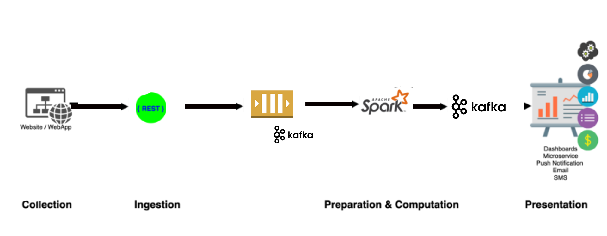
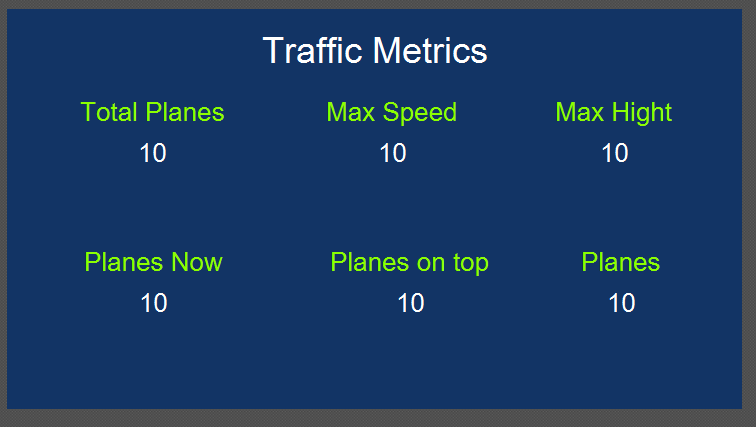

# BgData_FlightsStream_Pipeline

 

this pipeline collecte open air traffic data from the website openksy-network.com then send it as streaming data  to a kafka queue  which represents the data ingestion part of the pipeline  

then the apache spark application process this data by filtring the airplanes  flying over paris and find the fastest one and return the result to a representation part by sending it to a kafka queue . 

